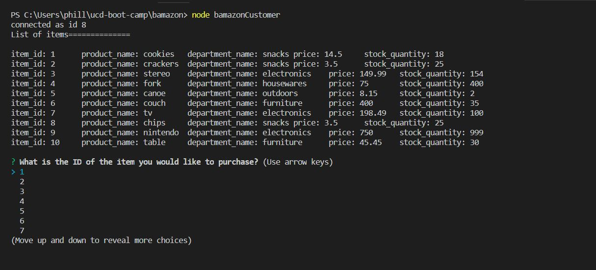

# Bamazon

Bamazon is a mock online shopping service powered by and Node.js and SQL. Using the main script bamazonCustomer, a user can view a list of available items and make purchases (as long as inventory allows it).

## Instructions

*(Before using)*

Ensure that you have installed all necessary packages using the `npm install` command in the project directory.

Also make sure the database has been set up using the `seeds.sql` file. Change DB credentials in `bamazonCustomer.js` as necessary.

Ensure your database is running on port 3306.

## Running bamazonCustomer
- Using the terminal, type `node bamazonCustomer` to start the application and view the inventory

- Choose the item you wish to purchase using the arrow keys to highlight and the enter key to choose

- Enter the quantity of the selected item you wish to purchase

- Your transaction total will be printed to the terminal

- Upon reloading the app we see that the inventory has updated

- *Note:* Be sure there is enough inventory for your purchase!

## Technologies
Node.js, JavaScript, MySQL